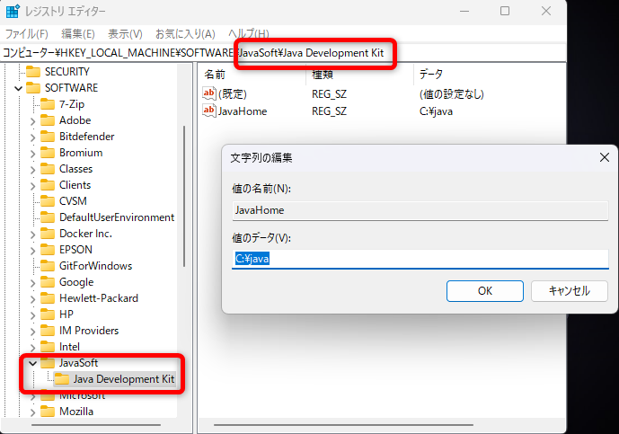

# XAMPPでTomcatを動かす設定

## 前提条件

XAMPPのインストール先は下記とする

```
C:\xampp
```

Java(JDK)のインストール先は下記とする

```
C:\java
```

## 設定ができていないと下記エラーが発生する

```
[Tomcat] 	Tomcat Started/Stopped with errors, return code: 1
[Tomcat] 	Make sure you have Java JDK or JRE installed and the required ports are free
[Tomcat] 	Check the "/xampp/tomcat/logs" folder for more information
```


## 環境変数の追加

| 変数名 | 値 |
|---|---|
| CATALINA_HOME | C:\xampp\tomcat |
| JAVA_HOME | C:\java |


## レジストリの追加

### 追加先

コンピューター\HKEY_LOCAL_MACHINE\SOFTWARE\JavaSoft\Java Development Kit\

※下記がなければキーとして追加  
JavaSoft\Java Development Kit\

### 追加内容

文字列 : JavaHome

値のデータ : C:\java



### フォルダ構成

- Servletの保存先

```
C:\xampp\tomcat\webapps\sample
```

- URL

```
http://localhost:8080/sample/
```

### Servletコンパイルコマンド

```bash
javac -classpath C:\xampp\tomcat\lib\servlet-api.jar HelloWorld.java
```
